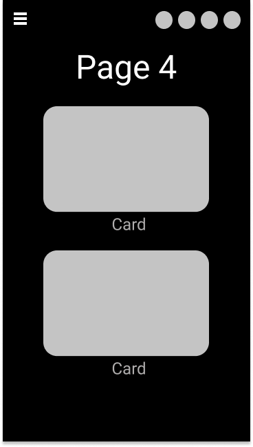

#README

### http://davebaines.xyz/portfolio/

### https://github.com/Bainezy94/portfolio

## Description

### Purpose
The purpose of my portfolio is to showcase the work I have completed and present this in a professional format to potential future employers.

### Functionality/Features
I attempt to use Microanimations where possible to make the user not have to think. This includes hover effects on clickable items, Nav links scroll page into view and nav links show the current page the user has scrolled to.

### Screenshots

###### Site Map

###### Trello

###### Desktop

###### Tablet

###### iPhone X

###### Galaxy S5

###### Desktop

###### Tablet

###### iPhone X

###### Galaxy S5

###### Desktop

###### Tablet

###### iPhone X

###### Galaxy S5

###### Desktop

###### Tablet

###### iPhone X

###### Galaxy S5

###### Desktop

###### Tablet

###### iPhone X

###### Galaxy S5

### Target Audience
The target audience is all employee seekers. The website has been designed 100% accessible for use of sreen readers and low vision users.

### Tech Stack
- HTML
- CSS
- Javascript

## Design

### Design Process

I chose to go with a dark theme using a dark background. The priamry colour used for fonts is the darkest shade of gray that is still ledgible on the dark background according to the Webaim guidelines.

I then added elements of colour on each page to bring attention to these elements. The colours used for the Brand icons are a combination of brands own colour and a shadowing of the brands colour ~15% darker.

The theme that I was going for was "A Modern Barbershop in France."

### Pinterest Board

### Wireframes

###### Desktop

###### Tablet

###### iPhone X

###### Galaxy S5

###### Desktop

###### Tablet

###### iPhone X

###### Galaxy S5

###### Desktop

###### Tablet

###### iPhone X

###### Galaxy S5

###### Desktop

###### Tablet

###### iPhone X

###### Galaxy S5

###### Desktop

###### Tablet

###### iPhone X

###### Galaxy S5

### Usability Considerations
The page is simple and only draws the users attention to key elements. All elements on the page have purpose so there is no clutter. The page is responsive to all devices allowing the user to get same experience on Desktop, Tablet & Mobile.

## Short Answer Q&A

### Describe key events in the development of the internet from the 1980s to today.
ARPANET (Advanced Research Projects Agency Network) was a prototype of the internet that was funded by the U.S. Department of Defense. It was designed to use packet switching to allow multiple computers to communicate on a single network but when TCP/IP was developed in the 1970's, it was soon adopted by ARPANET in 1983 as the standard  protocol across the internet. TCP/IP is still the primary protocol in use globally.

The Domain Name System (DNS) was developed in 1984 which allowed anyone to access a website with the name of a host instead of an IP address.

In 1995, TCP/IP hit a major road block when people realised the 32-bit numbering system used by IP version 4 would run out of available adresses. They resolved this be releasing IP version 6, a 128-bit numbering system that could thearetically use 3.4×1038 IP addresses.

### Define and describes the relationship between fundamental aspects of the internet such as: domains, web servers, DNS, and web browsers.
Browsers are used by the end user to access and display information on the internet. To access this information, you need to provide the browser with a domain name or IP address. If a valid domain name or IP address has been entered, the content of that address will be displayed to the user.

The DNS (Domain Name Server) is a system that allows a domain name to be converted into the relevant IP address. When a user enters a Domain name into their Web Browser, the name is first sent to the DNS to lookup that domains IP address. Once the IP addrss has been found by the DNS, the DNS will follow that IP to it's location and return the content to the browser. 

A Web Server is used by the client to host their site. When it recieves a request from a user, it provides content back depending on the data sent. Usually this will just be a page on their site.

### Reflect on one aspect of the development of internet technologies and how it has contributed to the world today
The introduction of Javascript was a huge development in internet technology. The use of JS along side HTML & CSS has allowed developers to provide much more function of their website to the user.

Most modern web browsers now have their own Javascript engin built in. Notably the V8 engine used by Chrome, Chromium, Opera and the newer version of Internet Edge for Windows and Mac. This engine allows for extremely fast parsing of JS which improves websites overall performance.

JS is not only used for Webistes for the end user but is also used by many servers for fast processing and delivering of information. 
